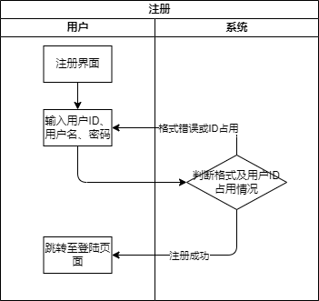
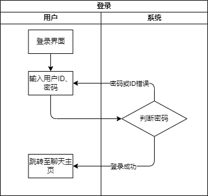
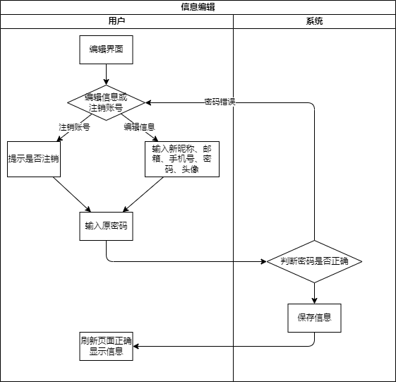
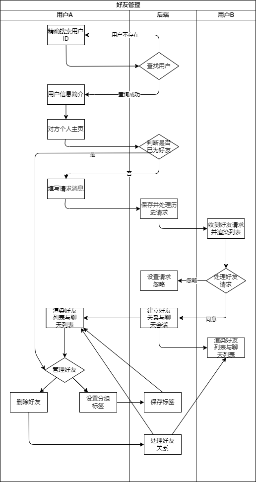
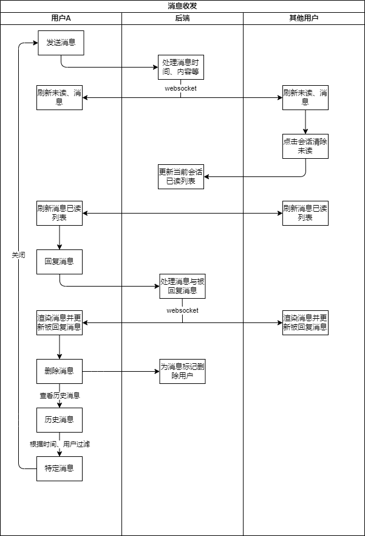
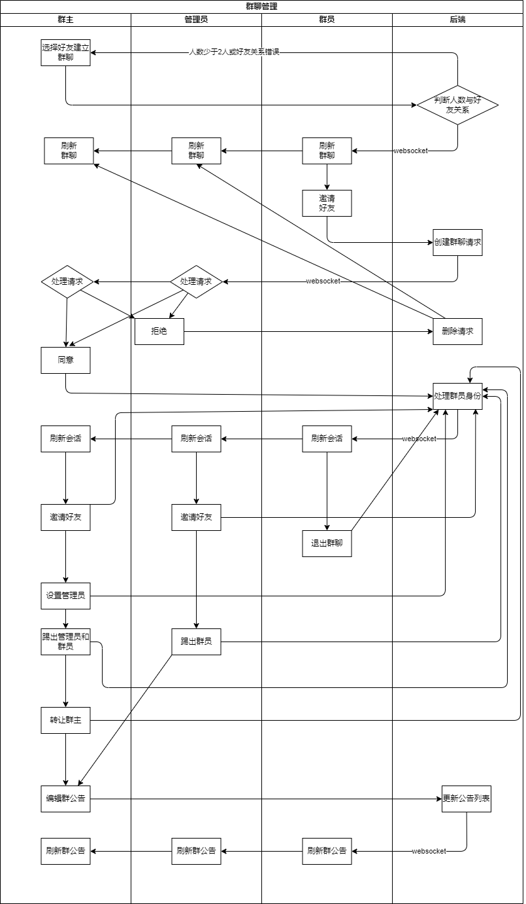

## 用户故事

### 用户注册

- 作为一个新用户,我希望能够快速注册一个新账号,只需要填写基本的个人信息(如用户名、密码)即可完成注册。
- 作为一个新用户,我希望注册过程中能得到清晰的提示和反馈,如果注册信息有误能够及时得到错误提示。

### 用户登录与登出

- 作为一个老用户,我希望能够快速登录到我的账号,只需要输入用户名和密码即可登录。
- 作为一个老用户,我希望登录过程中能得到清晰的提示和反馈,如果登录信息有误能够及时得到错误提示。
- 作为一个已登录用户,我希望登录后能自动同步之前的聊天记录,不会丢失任何消息。
- 作为一个已登录用户,我希望能够安全退出登录,以保护我的账号安全。

### 用户信息管理

- 作为一个已登录用户,我希望能够管理我的个人信息,包括修改用户名、密码、邮箱、手机号、头像等。
- 作为一个已登录用户,我希望修改敏感信息(如密码)时能够通过验证来确保安全性。
- 作为一个已登录用户,我希望修改个人信息后能够立即生效,不需要重新登录。
- 作为一个已登录用户，我希望能够注销账号，让其他人不能再进行登录、聊天、添加好友等操作。

### 好友管理

- 作为一个已登录用户,我希望能够通过搜索用户名或浏览好友列表来找到其他用户,并向他们发送好友申请。
- 作为一个已登录用户,我希望能够查看好友申请列表,并根据不同情况（同意、忽略）处理好友申请。
- 作为一个已登录用户,我希望能够查看自己的好友列表,并对好友进行分组管理。
- 作为一个已登录用户,我希望能够删除不需要的好友,同时保留之前与该好友的聊天记录。


### 消息收发

- 作为一个已登录用户,我希望能够与其他用户进行聊天,包括发送文本消息。
- 作为一个已登录用户,我希望看到每条消息的发送者、接收者、发送时间、消息内容、已读状态等信息。
- 作为一个已登录用户,我希望能够看到每个会话未读计数。
- 作为一个已登录用户,我希望收到的消息能够及时显示,不会因为网络问题而延迟。

### 聊天记录管理
- 作为一个已登录用户,我希望能够查看之前的聊天记录,并按照时间或发送者进行筛选和检索。
- 作为一个已登录用户,我希望能够删除自己不需要保留的聊天记录,但不会影响其他人查看该记录。

### 用户群组

- 作为一个已登录用户,我希望能够创建新的群聊,并从我的好友列表中邀请成员加入。
- 作为一个群聊成员,我希望能够查看群聊的基本信息,如群聊名称、群成员列表、公告、消息记录等。
- 作为一个群聊管理员,我希望能够管理群组,包括修改群组名称、头像、公告等。
- 作为一个群聊管理员,我希望能够邀请新成员加入群聊,并对群成员进行管理(如添加和踢出群聊)。
- 作为一个已登录用户,我希望能够查看和搜索群组消息记录。
- 作为一个已登录用户,我希望能够邀请他人加入群组。
- 作为一个群主，我希望能够转让群主，并对所有群成员进行管理（如设置和取消管理员、邀请和踢出群聊成员、修改群公告等）。

### 安全与隐私

- 作为一个已登录用户，我希望我的密码通过加密传输，防止被窃取、泄露。
- 作为一个已登录用户，我希望我的任何操作都需要验证权限，防止恶意操作。

## 工作流程图













## 模块

### 前端模块

前端主要由**首页模块**、**注册模块**、**登录模块**、**个人信息模块**、**聊天模块**、**默认模块**构成，有相应路由。其余模块内嵌于上述模块，分别为**头像模块**、**聊天窗口模块**、**会话选择模块**、**历史消息模块**、**主页模块**、**导航UI模块**、**菜单列表模块**、**聊天气泡模块**、**公告模块**。

| 首页模块 | 注册模块 | 登录模块 | 个人信息模块 | 聊天模块 |  默认模块 |
| --- | --- | --- | --- | --- | --- |
| /index | /register | /login | /user_info | /chat_interface | / |

#### 首页模块

用于跳转至注册和登录页面，并内嵌**导航UI模块**。

#### 注册模块

用于注册新用户，并将用户信息存储至数据库。

#### 登录模块

用于登录已有用户，并生成后续操作的 token。

#### 个人信息模块

用于展示用户的个人信息，并提供修改、注销功能。如果是他人主页，提供加好友、删除好友功能。

#### 聊天模块

主要聊天功能，几乎集成所有有关好友、群聊的功能，但功能都通过其他模块实现。内嵌**主页模块**、**菜单列表模块**。从后端拉取好友列表、群聊列表、好友请求列表、群聊申请列表，用以渲染**菜单列表模块**。

#### 默认模块

与**首页模块**一致，为所有页面提供**导航UI模块**的功能。

#### 头像模块

渲染头像，并且提供右键菜单，跳转到主页或修改分组标签。

#### 聊天窗口模块

通过**主页模块**提供的活跃会话过滤消息，渲染每条消息。提供发送消息、回复消息、删除消息的功能。通过活跃会话的群聊私聊属性渲染不同的会话窗口。为群聊管理功能提供各种函数接口，包括设置移除管理员、踢人、退群、转让群主、邀请入群等。同时提供聊天的侧栏功能，包括设置群公告、设置群头像、设置群名称、设置群头像、设置群公告等。侧栏还包括查看历史消息的接口。内嵌**聊天气泡模块**、**历史消息模块**、**公告模块**。

#### 会话选择模块

渲染会话列表，包括头像、名称、未读计数、最后一条消息等，并提供切换会话的功能。

#### 历史消息模块

从前端数据库获取当前会话的历史消息，并进行渲染，包括头像、名称、时间、消息内容等。可以根据时间、用户进行条件过滤，并可清除过滤条件。

#### 主页模块

从后端拉取聊天记录，更新本地数据库，并计算会话未读计数。记录当前选中会话，并渲染聊天窗口。内嵌**聊天窗口模块**、**会话选择模块**。

#### 导航UI模块

渲染导航栏，包括头像、用户名，提供登出与跳转至**聊天模块**的功能。导航栏还可跳转至**个人信息模块**、**首页模块**、**注册模块**、**登录模块**。并提供精确搜索用户的功能。

#### 菜单列表模块

用于渲染好友列表、群聊列表、好友请求列表、群聊申请列表，并提供相应的操作功能，包括同意、忽略好友申请，同意、拒绝群聊申请。内嵌**头像模块**。

#### 聊天气泡模块

渲染聊天气泡，包括头像、名称、消息内容、已读列表、回复计数等。根据消息属性渲染是否为回复消息，并提供删除消息的功能。

#### 公告模块

渲染公告列表，包括发表人、时间、头像、内容等。提供编辑新公告的功能。

### 后端模块

- 后端 `Account` 模块，提供用户注账号管理、用户登录和用户查找功能
- 后端 `Friendship` 模块，提供好友申请、列表拉取和好友管理功能
- 后端 `Chat` 模块，提供与消息、会话和群聊相关的功能。

#### 后端 Account 模块

- 账号管理：包括账号的注册与注销 (`register` 函数和 `delete` 函数) 和个人信息管理 (`profile` 函数拉取，`update_profile` 编辑) 功能
- 用户登录：登录并分配 `token`，用于后续操作的认证 ( `login` 函数)
- 用户查找：根据 `userId` 查找指定用户 ( `search_user`函数)

#### 后端 Friendship 模块

- 好友申请：包括好友请求的发送和接受 (`add_friend` 函数和 `accept_friend` 函数)
- 列表拉取：包括得到好友列表和好友请求列表 (`get`)
- 好友管理: 包括好友分组 (`add_tag`) 和删除好友 (`delete_friend`)

#### 后端 Chat 模块

- 消息的发送和拉取：
- 消息相关信息管理：维护详细的已读名单，删除者名单和被回复次数
- 会话的创建与拉取：
- 群聊管理
    - 成员管理：邀请用户、踢出成员和成员退群
    - 成员权限管理：转让群主、设置或移除管理员
    - 群聊信息修改：修改群名和群头像、创建群公告

## 数据库设计

### 前端

继承自 `Dexie` ，管理本地的 `IndexedDB` 数据库，主要用于对应到前端的 `Message` 和 `Conversation` 两个 `interface`。

#### messages

| 属性 | 类型 | 含义 |
| --- | --- | --- |
| id | int | 消息主键 |
| conversation | int | 会话 id |
| sender | str | 发送者 id |
| timestamp | datetime | 消息发送时间 |

---

#### conversations

| 属性 | 类型 | 含义 |
| --- | --- | --- |
| id | int | 主键 |
| type | str | 群聊类型，群聊和私聊 |

---

#### Message

| 属性 | 类型 | 含义 |
| --- | --- | --- |
| id | int | 消息主键 |
| conversation | int | 会话 id |
| sender | str | 发送者 |   
| senderId | str | 发送者 ID |
| content | str | 消息内容 |
| timestamp | datetime | 消息发送时间 |
| sendTime | datetime | 服务器端消息发送时间 |
| avatar | str | 头像 |
| readList | list[str] | 已读用户列表 |
| replyId | int | 回复消息的ID |
| replyCount | int | 回复消息的计数 |
| deleteList | list[str] | 删除用户列表 |

---

#### Conversation

| 属性 | 类型 | 含义 |
| --- | --- | --- |
| id | int | 会话 id |
| type | str | 群聊类型，群聊和私聊 |
| members | list[User] | 会话成员 |
| unreadCount | int | 未读计数 |
| avatarUrl | str | 头像 |
| otherUserId | str | 私聊对方的 ID |
| # 以下为群聊的字段 |  |  |
| groupName | str | 群名 |
| groupNotificationList | list[Notification] | 群公告列表 |
| host | User | 群主 |
| hostId | str | 群主 ID |
| adminList | list[User] | 管理员列表 |
| adminIdList | list[str] | 管理员 ID 列表 |

---

#### User

| 属性 | 类型 | 含义 |
| --- | --- | --- |
| id | int | 主键 |
| userId | str | 用户 id |
| userName | str | 用户名 |
| avatarUrl | str | 头像 |
| isDeleted | bool | 是否已经注销 |

---

### 后端

选用 `SQLite` 作为后端数据库。

#### User

表示用户的账户资料

| 属性 | 类型 | 含义 |
| --- | --- | --- |
| id | int | 主键 |
| userId | str | 账号，唯一，用于标识用户身份 |
| password | str | 密码，加密储存在数据库中 |
| email | str | 邮箱 |
| phoneNumber | str | 电话号码 |
| avatarUrl | str | 表示头像的字符串 |
| isDeleted | bool | 账户状态, True表示已注销，注销的用户保留已有数据，但不再产生新的相关数据 |

---

#### Friendship

表示好友关系，一对好友对应两条记录

| 属性 | 类型 | 含义 |
| --- | --- | --- |
| id | int |  |
| userId | str | 用户账号 |
| friendId | str | 好友账号 |
| tag | str | 对好友的分组（备注） |
| status | bool | False表示已删除，不能在打tag和发消息 |

---

#### FriendshipRequest

| 属性 | 类型 | 含义 |
| --- | --- | --- |
| id | int |  |
| senderId | str | 请求发送者的账号 |
| receiverId | str | 接受请求者的账号 |
| sendTime | 时间戳 | 发送时间 |
| message | str | 请求中打招呼的内容 |
| status | int | 请求状态，0为未处理，1为已接受，2为已过期 |

#### Conversation

| 属性 | 类型 | 含义 |
| --- | --- | --- |
| id | int |  |
| type | str | 群聊类型，群聊和私聊 |
| members | list[User] | 会话成员 |
| status | bool | False表示群聊已失效，主要用于私聊和Friendship的状态保持一致 |
| # 以下为群聊的字段 |  |  |
| host | User | 群主 |
| admins | list[User] | 管理员 |
| avatarUrl | str | 群聊头像，私聊显示对方头像 |
| groupName | str | 群名 |
| groupNotificationList | list[Notification] | 群公告列表 |

---

#### Notification

| 属性 | 类型 | 含义 |
| --- | --- | --- |
| id | int | 主键 |
| userId | str | 发布者账号 |
| userName | str | 发布者呢称 |
| avatarUrl | str | 发布者头像 |
| content | str | 群通知的内容 |
| timestamp | datetime | 发送时间 |

---

#### Message

| 属性 | 类型 | 含义 |
| --- | --- | --- |
| id | int |  |
| conversation | Conversation | 所属会话 |
| sender | User | 发送者 |
| receiver | list[User] | 接收者 |
| sendTime | datetime | 消息发送时间 |
| updateTime | datetime | 消息更新时间 |
| content | str | 消息内容 |
| replyTo | Message | 引用消息的id |
| readUsers | list[User] | 已读名单 |
| deleteUsers | list[User] | 删除这条消息的名单 |
| replyCount | int | 被回复次数 |

---

#### Invitation

| 属性 | 类型 | 含义 |
| --- | --- | --- |
| id | int |  |
| sender | User | 发送者 |
| receiver | User | 接收者，为群聊的群主和管理员，而不是被邀请者 |
| timestamp | datetime | 邀请更新时间 |

## API 设计

### 状态码

| 状态码 | 错误码 | 含义 |
| --- | --- | --- |
| 400 | -2 | 请求错误，例如格式错误、缺少参数 |
| 401 | -3 | 认证失败，如密码错误、token失效 |
| 404 | -1 | 无法请求资源 |
| 403 | -4 | 拒绝访问并且无需说明理由 |
| 200 | 0 | 成功请求 |

### 注册 /register

#### 功能描述

用户注册功能，用户输入ID、用户名、密码等信息，系统自动生成用户
ID，并将用户信息存储到数据库中。对用户 ID、密码进行一定的格式要求规范，并进行密码加密存储。

#### 输入参数

- 用户 ID：用户 ID，长度限制 3-16
个字符，只能包含字母、数字、下划线。
- 用户名：用户名，长度限制 3-16
个字符，只能包含字母、数字、下划线、中文。
- 密码：密码，长度限制 6-16 个字符，只能包含字母、数字、下划线。

#### 请求

使用 POST 方法，请求地址为 `/register`，请求包含 JSON
格式的正文。

```json
{
  "userId": "test_id",
  "userName": "test_user",
  "password": "123456",  
}
```

- `userId` 必选，不可重复，表示用户
ID，只能包含字母、数字、下划线，长度限制 3-16 个字符。
- `userName` 必选，表示用户名，只能包含字母、数字、下划线、中文，3-16
个字符。
- `password` 必选，表示密码，只能包含字母、数字、下划线，6-16 个字符。

#### 行为

- 系统验证用户输入的ID、用户名、密码是否符合格式要求，ID
是否唯一。
- 系统对密码进行加密，并将用户信息存储到数据库中。

#### 响应

注册成功：设置 HTTP 状态码为 HTTP 200 OK，响应为空，提示用户创建成功，并跳转到登录页面。

```json
{
	"code": 0,
	"info": "Succeed"
	"url": "/login"
}
```

#### 异常处理

所有错误响应的格式均为：

```json
{  
	"code": *,  
	"info": "[error message]"
}
```

- `code` 表示错误码
- `info` 表示错误信息

| 状态码 | 错误码 | 错误原因 | 错误提示 |
| --- | --- | --- | --- |
| 405 | -3 | 请求方式错误，如使用了 GET 方法 | 请求方式错误 |
| 400 | -2 | 缺少用户 ID 或格式错误 | 用户 ID 格式错误，请重试 |
| 400 | -2 | 缺少用户名或格式错误 | 用户名格式错误，请重试 |
| 400 | -2 | 缺少密码或格式错误 | 密码格式错误，请重试 |
| 400 | -2 | 用户 ID 重复或使用被注销 ID | 用户 ID 已被占用，请重试 |

---

### 登录 /login

#### 输入参数

- 用户名：用户名。
- 密码：密码。

#### 请求

使用 POST 方法，请求地址为 `/login` 。

```json
{
	"userId": "myId",
	"password": "myPassword",
}
```

- `userId` 表示用户 ID
- `password` 表示用户密码

#### 响应

若用户 ID 存在，且密码与数据库核对成功时，请求成功，状态码为 200 OK，登录并跳转。

```json
{
	"code": 0,
	"info": "Succeed",
	"url": "/chat/<id>",
	"id": "userId"
	"token": "***.***.***"
}
```

- `url` 表示用户登录后跳转的聊天窗口的 url
- `id` 表示用户 ID
- `token` 为签发的 JWT 令牌，后续用户每一步操作都需要验证 JWT 令牌

#### 异常处理

所有异常响应格式均为：

```json
{  
	"code": *,  
	"info": "[error message]"
}
```

| 状态码 | 错误码 | 错误原因 | 错误提示 |
| --- | --- | --- | --- |
| 404 | -1 | 用户 ID 不存在 | 用户 ID 不存在，请重试 |
| 401 | -3 | 密码错误 | 账号或密码错误，请重试 |
| 404 | -1 | 用户已注销 | 该用户已注销 |
| 400 | -2 | 缺少 ID 或密码 | 缺少 ID 或密码 |

---

### 注销 /delete

#### 请求

使用 POST 方法，请求地址为 `/cancel` ，需要对用户身份进行验证。

```json
{
	"userId": "myId",
	"password": "myPassword",
	"token": "***.***.***"
}
```

- `userId` 表示用户 ID
- `password` 表示用户密码
- `token` 表示 JWT 令牌

#### 响应

若用户 ID 和密码与数据库核对成功时，请求成功，状态码为 200 OK，跳转到注册页面。

```json
{
	"code": 0,
	"info": "Succeed",
	"url": "/register"
}
```

#### 异常处理

所有异常响应格式均为：

```json
{  
	"code": *,  
	"info": "[error message]"
}
```

| 状态码 | 错误码 | 错误原因 | 错误提示 |
| --- | --- | --- | --- |
| 401 | -3 | 密码错误 | 密码错误，请重试 |
| 404 | -1 | 用户已注销或用户 ID 错误或 ID 不存在 | ID 错误，请重试 |
| 400 | -2 | 缺少 ID 或密码 | 缺少 ID 或密码 |

---

### 登出 /logout

#### 请求

使用 POST 方法，请求地址为 `/logout` 。

```json
{
	"userId": "myId"
}
```

- `userId` 表示用户 ID

#### 响应

若用户 ID 存在，且密码与数据库核对成功时，请求成功，状态码为 200 OK，并跳转至登陆界面。

```json
{
	"code": 0,
	"info": "Succeed",
	"url": "/login",
}
```

- `url` 表示跳转 url

#### 异常处理

无异常处理

---

### 个人信息页面 /profile/<userId>

#### 请求

使用 GET 方法 ，无请求体。

### 响应

若用户 ID 和密码与数据库核对成功时，请求成功，状态码为 200 OK。

```json
{
	"code": 0,
	"info": "Succeed",
	"userId": "theirId",
	"userName": "theirName",
	"avatar": "avatar",
	"email": "myEmail@xx.xxx"
	"phoneNumber": "12345678900"
}
```

- `userId` 表示用户 ID
- `userName` 表示用户名
- `avatar` 表示用户头像路径
- `email` 表示用户邮箱
- `phoneNumber` 表示用户电话号码

#### 异常处理

所有异常响应格式均为：

```json
{  
	"code": *,  
	"info": "[error message]"
}
```

| 状态码 | 错误码 | 错误原因 | 错误提示 |
| --- | --- | --- | --- |
| 404 | -1 | 用户 ID 错误或 ID 不存在 | 用户不存在 |
| 404 | -2 | 用户已注销 | 用户已注销 |

---

### 用户资料修改 update_profile/<userId>

#### 请求

使用 POST 方法 。

```json
{
	"newName": "myName",
	"newPassword": "bcd"
	"newEmail": "myEmail",
	"newPhoneNumber": "11122223333",
	"newAvatar": "myAvatar",
	"password": "abc",
	"token": "***.***.***"
}
```

- `newName` 表示新用户名
- `newPassword` 表示新密码
- `newEmail` 表示新邮箱
- `newPhoneNumber` 表示新号码
- `newAvatar` 表示新头像
- `password` 表示密码
- `token` 表示 JWT 令牌

没有修改的就不用包含进请求里。

#### 响应

若 token 核对成功，状态码为 200 OK。

```json
{
	"code": 0,
	"info": "Succeed",
	"url": "/profile/<userId>",
}
```

- `url` 表示跳转 url

#### 异常处理

所有异常响应格式均为：

```json
{  
	"code": *,  
	"info": "[error message]"
}
```

| 状态码 | 错误码 | 错误原因 | 错误提示 |
| --- | --- | --- | --- |
| 401 | -3 | JWT 令牌错误或过期 | 登录已失效，跳转至 /login |
| 403 | -4 | 用户 ID 验证失败 | 没有操作权限 |
| 401 | -3 | 密码错误   | 验证失败，请重试 |
| 404 | -1 | 用户已注销或用户 ID 错误或 ID 不存在 | ID 错误，请重试 |

---

### 用户查找 /search/<userId>

#### 请求

使用 POST 方法 。

```json
{
	"searchId": "targetId",
	"token": "***.***.***"
}
```

- `searchId` 表示想要搜索的用户userId
- `token` 表示 JWT 令牌

#### 响应

若 token 核对成功，状态码为 200 OK，返回用户基本信息。

```json
{
	"code": 0,
	"info": "Succeed",
	"id": "2",
	"name": "Ace"
	"avatar":"path/avt.jpg"
	"isDeleted":False
}
```

- `id` 表示用户id
- `name`表示用户名称
- `email`表示用户邮箱
- `phone`表示用户手机
- `avatar`表示用户头像的储存路径

#### 异常处理

所有异常响应格式均为：

```json
{  
	"code": *,  
	"info": "[error message]",
	"url": "/newUrl"
}
```

| 状态码 | 错误码 | 错误原因 | 错误提示 |
| --- | --- | --- | --- |
| 401 | -3 | JWT 令牌错误或过期 | 登录已失效，跳转至 /login |
| 403 | -4 | 用户名与原用户名重复 | 用户名重复，请重试 |
| 401 | -3 | 密码错误 | 验证失败，请重试 |
| 404 | -1 | 用户已注销或用户 ID 错误或 ID 不存在 | ID 错误，请重试 |

---

### 好友申请 /friends/add_friend

#### POST请求

发送好友申请。

```json
{
	"userId": "userId"
	"searchId": "targetId",
	"message":"Aloha!"
	"token": "***.***.***"
}
```

- `id` 表示本人用户ID
- `searchId` 表示想要添加的用户ID
- `message` 表示打招呼的消息
- `token` 表示 JWT 令牌

#### 响应

若 token 核对成功，状态码为 200 OK。

```json
{
	"code": 0,
	"message": "成功发送请求",
}
```

#### 异常处理

所有异常响应格式均为：

```json
{  
	"code": *,  
	"info": "[error message]"
}
```

| 状态码 | 错误码 | 错误原因 | 错误提示 |
| --- | --- | --- | --- |
| 401 | -3 | JWT 令牌错误或过期 | 登录已失效，跳转至 /login |
| 404 | -1 | 本人用户已注销或用户 ID 错误或 ID 不存在 | ID 错误，请重试 |
| 404 | -1 | 查找用户已注销或用户 ID 错误或 ID 不存在 | 查找ID不存在，请重试 |
| 403 | -4 | 试图添加已存在好友 | 已经是好友，请重试 |
| 403 | -4 | 试图添加自己为好友 | 不可添加自己为好友 |
| 403 | -4 | 试图多次发送好友请求 | 发送好友申请过于频繁 |

---

### 接受好友请求/friends/accept_friend

#### 请求 POST

```json
{
 "senderId": "alice",
 "receiverId": "Bob",
 "token": "***.***.***"
}
```

#### 响应

```json
{
	"code": 0,
	"message": "接受成功",
}
```

#### 异常处理

```json
{
	"code":*,
	"info": "[error message]",
}
```

| 状态码 | 错误码 | 提示信息 |
| --- | --- | --- |
| 401 | -3 | JWT 验证失败 |
| 403 | -4 | 已经是好友 |
| 404 | -1 | 用户不存在 |

---

### 好友请求列表 /friends/myrequests/<userId>

#### 请求 GET

```json
{
	"token": "***.***.***"
}
```

- `id` 表示用户自身 ID
- `token` 表示 JWT 令牌

#### 响应

若 token 核对成功，状态码为 200 OK，返回用户基本信息。

```json
{
	"code": 0,
	"info": "Succeed",
	"data": [
		{
			"id": "2",
			"name": "Ace"
			"message": "Hello",
			"status": True,
			"sendTime": "",
			"avatarUrl": "path/avt1.jpg"
		},
		{
			"id": "3",
			"name": "bob"
			"message": "HI",
			"status": False,
			"sendTime": "",
			"avatarUrl": "path/avt2.jpg"
		}
	]
}
```

- `data` 表示好友申请列表
- `id` 表示用户id
- `name`表示用户名称
- `message` 表示发送请求的消息
- `status` 表示申请状态，只能为 True or False(接受和未处理)
- `avatarUrl`表示用户头像的储存路径

#### 异常处理

所有异常响应格式均为：

```json
{  
	"code": *,  
	"info": "[error message]"
}
```

| 状态码 | 错误码 | 错误原因 | 错误提示 |
| --- | --- | --- | --- |
| 401 | -3 | JWT 令牌错误或过期 | 登录已失效，跳转至 /login |

---

### 好友列表/friends/myfriends/<userId>

#### GET请求

```json
{
	"token": "***.****.***"
}
```

#### 响应

若成功

```json
{
	"code": 0,
	"info": "Succeed",
	"data": [
		{
			"userId": "ace",
			"userName": "Ace",
			"avatarUrl": "xxx",
			"isDeleted": False,
			"tag": "同学"
		},
		{
			"userId": "bob",
			"userName": "bob",
			"avatarUrl": "xxx",
			"isDeleted": False,
			"tag": "家人"
		}
	]
}
```

返回的data是一个list

- `userId` 表示好友的用户Id
- `userName`表示好友的用户名
- `avatarUrl` 表示好友的头像
- `isDeleted` 表示好友的账户状态(是否注销)

---

### 删除好友 /friends/delete_friend

#### POST请求

从好友列表中删除好友。

```json
{
	"userId": "userId"
	"friendId": "targetId",
	"token": "***.***.***"
}
```

- `userId` 表示本人用户ID
- `friendId` 表示想要删除的用户ID
- `token` 表示 JWT 令牌

#### 响应

若 token 核对成功，状态码为 200 OK。

```json
{
	"code": 0,
	"message": "删除成功",
}
```

#### 异常处理

所有异常响应格式均为：

```json
{  
	"code": *,  
	"info": "[error message]"
}
```

| 状态码 | 错误码 | 错误原因 | 错误提示 |
| --- | --- | --- | --- |
| 401 | -3 | JWT 令牌错误或过期 | 登录已失效，跳转至 /login |
| 404 | -1 | 本人用户已注销或用户 ID 错误或 ID 不存在 | ID 错误，请重试 |
| 404 | -1 | 查找用户已注销或用户 ID 错误或 ID 不存在 | 好友ID不存在，请重试 |
| 404 | -1 | 对方不是你的好友 | 好友关系不存在 |

---

### 打标签 /friends/add_tag

#### POST请求

```json
{
	"userId": "alice",
	"friendId": "bob",
	"tag": "同学",
	"token": "***.***.***"
}
```

#### 响应

```json
{
	"code": 0,
	"message": "tag添加成功",
}
```

#### 异常处理

```json
{  
	"code": *,  
	"info": "[error message]",
}
```

| 状态码 | 错误码 | 错误提示 |
| --- | --- | --- |
| 401 | -3 | JWT 验证失败 |
| 404 | -1 | 好友已注销 |
| 404 | -1 | 好友关系不存在 |
| 400 | -2 | tag过长 |

---

### 收发消息/chat/massages

#### POST请求

```json
{
	"userId": "alice",
	"conversationId": "bob",
	"content": "同学"，
	"replyId": "bob"，
	"token": "***.***.***"
}
```

#### 响应

若 token 核对成功，状态码为 200 OK。

```json
{
	"code": 0
}
```

#### 异常处理

```json
{  
	"code": *,  
	"info": "[error message]",
}
```

| 状态码 | 错误码 | 错误提示 |
| --- | --- | --- |
| 401 | -3 | JWT 验证失败 |
| 400 | -2 | 会话不存在 |
| 400 | -2 | 用户不存在或已注销 |
| 403 | -4 | 用户不在会话中 |
| 400 | -2 | 好友已注销 |
| 400 | -2 | 回复原消息不存在 |

#### GET请求

```json
{
	"userId": "alice",
	"conversationId": "bob",
	"after": "0",
	"limit": "100",
	"afterDatetime": "***",
	"token":"***.***.***"
}
```

#### 响应

```jsx
{
	"code": 0,
	"info": "Succeed",
	"messages": ["1","2"],
	"hasNext": False,
}
```

#### 异常处理

```json
{  
	"code": *,  
	"info": "[error message]",
}
```

| 状态码 | 错误码 | 错误提示 |
| --- | --- | --- |
| 401 | -3 | JWT 验证失败 |
| 400 | -2 | 用户不存在或已注销 |

---

### 获取会话列表 /chat/conversations

#### GET 请求

获取用户的会话列表。

```json
{
	"userId": "12",
	"id": ["1","2"],
	"token": "***.***.***"
}
```

- `userId` 为当前用户ID
- `id` 为需要拉取的会话ID列表，可选

#### 响应

```json
{
    "conversations": [
        {
            "id": "xxx",
            "type": "private_chat",
            "avatarUrl": "https://...",
            "displayName": "John Doe",
            "updatedAt": "2023-05-23T12:34:56Z",
            "unreadCount": 5
        },
        {
            "id": "yyy",
            "type": "group_chat",
            "avatarUrl": "https://...",
            "displayName": "Group Chat",
            "updatedAt": "2023-05-22T11:22:33Z",
            "unreadCount": 0
        }
    ]
}

```

- `id` 为会话ID
- `type` 为会话类型，`private_chat` 或 `group_chat`
- `avatarUrl` 为会话头像URL
- `displayName` 为会话名称
- `updatedAt` 为最后更新时间
- `unreadCount` 为未读消息数

#### 异常处理

| 状态码 | 错误码 | 错误提示 |
| --- | --- | --- |
| 401 | -3 | JWT 验证失败 |
| 400 | -2 | 用户不存在 |

### 创建会话 /chat/conversations

#### POST 请求

创建一个新的会话。

```json
{
    "userId": "xxx",
    "memberIds": ["xxx", "yyy", "zzz"],
    "token": "xxx.xxx.xxx"
}
```

- `userId` 为创建者ID
- `memberIds` 为会话成员ID列表
- `token` 为JWT令牌

#### 响应

```json
{
    "id": "xxx",
    "type": "group_chat",
    "avatarUrl": "https://...",
    "displayName": "Group Chat",
    "updatedAt": "2023-05-23T12:34:56Z",
    "unreadCount": 0
}

```

#### 异常处理

| 状态码 | 错误码 | 错误提示 |
| --- | --- | --- |
| 401 | -3 | JWT 验证失败 |
| 400 | -2 | 用户不存在 |
| 400 | -2 | 群聊人数过少 |

---

### **删除消息 /chat/delete_message**

#### **POST 请求**

删除指定消息。

```json
{
    "userId": "xxx",
    "messageId": 123
}
```

- `userId` 为当前用户ID
- `messageId` 为需要删除的消息ID

#### **响应**

```json
{
    "info": "删除成功"
}
```

#### **异常处理**

| 状态码 | 错误码 | 错误提示 |
| --- | --- | --- |
| 401 | -3 | JWT 验证失败 |
| 400 | -2 | 消息不存在 |
| 403 | -4 | 消息已删除 |

---

### **标记消息已读 /chat/read_message**

#### **POST 请求**

标记指定会话中的未读消息为已读。

```json
{
    "userId": "xxx",
    "conversationId": 123
}
```

- `userId` 为当前用户ID
- `conversationId` 为需要标记的会话ID

#### **响应**

```json
{
    "info": "已读成功"
}
```

#### **异常处理**

| 状态码 | 错误码 | 错误提示 |
| --- | --- | --- |
| 401 | -3 | JWT 验证失败 |
| 400 | -2 | 用户不存在 |

---

### **获取会话ID列表 /chat/get_conversation_ids**

#### **GET 请求**

获取指定用户所参与的所有会话 ID。

```json
{
	"userId": "123",
	"token": "***.***.***"
}
```

- `userId` 为当前用户ID

#### **响应**

```json
{
    "conversationIds": [1, 2, 3, ...]
}
```

- `conversationIds` 为用户所参与的会话 ID 列表

#### **异常处理**

| 状态码 | 错误码 | 错误提示 |
| --- | --- | --- |
| 401 | -3 | JWT 验证失败 |

---

### **获取会话未读消息数量 /chat/get_unread_count**

#### **GET 请求**

获取指定用户在指定会话中的未读消息数量。

```json
{
	"userId": "123",
	"conversationId": 1,
}
```

- `userId` 为当前用户ID
- `conversationId` 为要查询的会话ID

#### **响应**

```json
{
    "count": 5
}
```

- `count` 为指定会话中当前用户的未读消息数量

#### **异常处理**

| 状态码 | 错误码 | 错误提示 |
| --- | --- | --- |
| 401 | -3 | JWT 验证失败 |

---

### **上传群组消息通知 /chat/upload_notification**

#### **POST 请求**

上传一条新的群组消息通知。

#### **请求参数**

```json
{
    "userId": "xxx",
    "groupId": 123,
    "content": "通知的内容"
}
```

- `userId`: 当前用户的ID
- `groupId`: 要发送通知的群组ID
- `content`: 通知的内容

#### **响应**

```json
{
    "id": 456,
    "conversation": 123,
    "content": "通知的内容",
    "userId": "xxx",
    "userName": "用户名",
    "avatarUrl": "头像URL",
    "timestamp": "2023-05-23T12:00:00Z"
}
```

- `id`: 新创建的通知ID
- `conversation`: 关联的群组ID
- `content`: 通知的内容
- `userId`: 发送通知的用户ID
- `userName`: 发送通知的用户名
- `avatarUrl`: 发送通知的用户头像URL
- `timestamp`: 通知创建的时间戳

#### **异常处理**

| 状态码 | 错误码 | 错误提示 |
| --- | --- | --- |
| 400 | -2 | 用户不存在 |
| 403 | -4 | 权限不足 |

---

### **设置群组群主 /chat/set_host**

#### **POST 请求**

设置指定群组的新群主。

#### **请求参数**

```json
{
    "oldHostId": "xxx",
    "newHostId": "yyy",
    "groupId": 123
}
```

- `oldHostId`: 当前群主的ID
- `newHostId`: 新群主的ID
- `groupId`: 要修改群主的群组ID

#### **响应**

```json
{
    "id": 123,
    "name": "群组名称",
    "type": "group_chat",
    "avatarUrl": "群组头像URL",
    "host": "yyy",
    "admins": ["aaa", "bbb"],
    "members": ["xxx", "yyy", "aaa", "bbb"]
}
```

- `id`: 群组ID
- `name`: 群组名称
- `type`: 群组类型
- `avatarUrl`: 群组头像URL
- `host`: 新的群主ID
- `admins`: 群组管理员ID列表
- `members`: 群组成员ID列表

#### **异常处理**

| 状态码 | 错误码 | 错误提示 |
| --- | --- | --- |
| 400 | -2 | 用户不存在 / 会话不存在 |
| 401 | -3 | JWT 验证失败 |
| 403 | -4 | 权限不足 / 新群主不能与旧群主相同 |

---

### **设置群组管理员 /chat/set_admin**

#### **POST 请求**

为指定群组设置新的管理员。

#### **请求参数**

```json
{
    "hostId": "xxx",
    "groupId": 123,
    "adminId": "yyy"
}
```

- `hostId`: 当前群主的ID
- `groupId`: 要设置管理员的群组ID
- `adminId`: 要设置为管理员的用户ID

#### **响应**

```json
{
    "id": 123,
    "name": "群组名称",
    "type": "group_chat",
    "avatarUrl": "群组头像URL",
    "host": "xxx",
    "admins": ["xxx", "yyy"],
    "members": ["xxx", "yyy", "aaa", "bbb"]
}
```

- `id`: 群组ID
- `name`: 群组名称
- `type`: 群组类型
- `avatarUrl`: 群组头像URL
- `host`: 群组群主ID
- `admins`: 群组管理员ID列表
- `members`: 群组成员ID列表

#### **异常处理**

| 状态码 | 错误码 | 错误提示 |
| --- | --- | --- |
| 400 | -2 | 用户不存在 / 会话不存在 |
| 401 | -3 | JWT 验证失败 |
| 403 | -4 | 权限不足 / 权限已存在 |

---

### **移除群组管理员 /chat/remove_admin**

#### **POST 请求**

移除指定群组的管理员。

#### **请求参数**

```json
{
    "hostId": "xxx",
    "groupId": 123,
    "adminId": "yyy"
}
```

- `hostId`: 当前群主的ID
- `groupId`: 要移除管理员的群组ID
- `adminId`: 要移除管理员权限的用户ID

#### **响应**

```json
{
    "id": 123,
    "name": "群组名称",
    "type": "group_chat",
    "avatarUrl": "群组头像URL",
    "host": "xxx",
    "admins": ["xxx"],
    "members": ["xxx", "yyy", "aaa", "bbb"]
}
```

- `id`: 群组ID
- `name`: 群组名称
- `type`: 群组类型
- `avatarUrl`: 群组头像URL
- `host`: 群组群主ID
- `admins`: 群组管理员ID列表
- `members`: 群组成员ID列表

#### **异常处理**

| 状态码 | 错误码 | 错误提示 |
| --- | --- | --- |
| 400 | -2 | 用户不存在 / 会话不存在 |
| 401 | -3 | JWT 验证失败 |
| 403 | -4 | 权限不足 / 权限不存在 |

---

### **踢出群组成员 /chat/kick_member**

#### **POST 请求**

将指定成员从群组中踢出。

#### **请求参数**

```json
{
    "opId": "xxx",
    "groupId": 123,
    "memberId": "yyy"
}
```

- `opId`: 执行踢出操作的用户ID
- `groupId`: 要踢出成员的群组ID
- `memberId`: 要踢出的成员ID

#### **响应**

```json
{
    "id": 123,
    "name": "群组名称",
    "type": "group_chat",
    "avatarUrl": "群组头像URL",
    "host": "xxx",
    "admins": ["xxx", "aaa"],
    "members": ["xxx", "aaa", "bbb"]
}
```

- `id`: 群组ID
- `name`: 群组名称
- `type`: 群组类型
- `avatarUrl`: 群组头像URL
- `host`: 群组群主ID
- `admins`: 群组管理员ID列表
- `members`: 群组成员ID列表

#### **异常处理**

| 状态码 | 错误码 | 错误提示 |
| --- | --- | --- |
| 400 | -2 | 用户不存在 / 群聊不存在 |
| 401 | -3 | JWT 验证失败 |
| 403 | -4 | 权限不足 |

---

### **退出群组 /chat/exit_group**

#### **POST 请求**

用户退出指定的群组。

#### **请求参数**

```json
{
    "userId": "xxx",
    "groupId": 123
}
```

- `userId`: 要退出群组的用户ID
- `groupId`: 要退出的群组ID

#### **响应**

```json
{
    "id": 123,
    "name": "群组名称",
    "type": "group_chat",
    "avatarUrl": "群组头像URL",
    "host": "xxx",
    "admins": ["xxx", "aaa"],
    "members": ["xxx", "aaa", "bbb"]
}
```

- `id`: 群组ID
- `name`: 群组名称
- `type`: 群组类型
- `avatarUrl`: 群组头像URL
- `host`: 群组群主ID
- `admins`: 群组管理员ID列表
- `members`: 群组成员ID列表

#### **异常处理**

| 状态码 | 错误码 | 错误提示 |
| --- | --- | --- |
| 400 | -2 | 用户不存在 / 群聊不存在 |
| 403 | -4 | 权限不足 |

---

### **邀请成员加入群组 /chat/invite_member**

#### **POST 请求**

邀请指定的用户加入群组。

#### **请求参数**

```json
{
    "opId": "xxx",
    "groupId": 123,
    "memberIds": ["yyy", "zzz"]
}
```

- `opId`: 执行邀请操作的用户ID
- `groupId`: 要邀请成员加入的群组ID
- `memberIds`: 要邀请加入的用户ID列表

#### **响应**

#### **1. 发送邀请**

```json
{
    "id": 1,
    "sender": "xxx",
    "receiver": "yyy",
    "conversation": 123,
    "timestamp": "2023-05-24T05:07:58.273829Z"
}
```

- `id`: 邀请ID
- `sender`: 邀请发送者ID
- `receiver`: 被邀请者ID
- `conversation`: 所属群组ID
- `timestamp`: 邀请发送时间

#### **2. 成员加入群组**

```json
{
    "id": 123,
    "name": "群组名称",
    "type": "group_chat",
    "avatarUrl": "群组头像URL",
    "host": "xxx",
    "admins": ["xxx", "aaa"],
    "members": ["xxx", "aaa", "bbb", "yyy", "zzz"]
}
```

- `id`: 群组ID
- `name`: 群组名称
- `type`: 群组类型
- `avatarUrl`: 群组头像URL
- `host`: 群组群主ID
- `admins`: 群组管理员ID列表
- `members`: 群组成员ID列表

#### **异常处理**

| 状态码 | 错误码 | 错误提示 |
| --- | --- | --- |
| 400 | -2 | 用户不存在 / 群聊不存在 / 邀请对象账户不存在 |
| 401 | -3 | JWT 验证失败 |
| 403 | -4 | 邀请对象不能为空 / 成员已在群里 / 权限不足 |

---

### **获取群组邀请 /chat/group_requests/<userId>**

#### **GET 请求**

获取指定用户的未处理的群组邀请列表。

#### **URL 参数**

- `userId`: 要查询邀请的用户ID

#### **响应**

```json
[
    {
        "id": 1,
        "sender": "xxx",
        "receiver": "yyy",
        "conversation": 123,
        "timestamp": "2023-05-24T05:07:58.273829Z"
    },
    {
        "id": 2,
        "sender": "aaa",
        "receiver": "yyy",
        "conversation": 456,
        "timestamp": "2023-05-25T10:15:30.654321Z"
    }
]
```

- `id`: 邀请ID
- `sender`: 邀请发送者ID
- `receiver`: 被邀请者ID
- `conversation`: 所属群组ID
- `timestamp`: 邀请发送时间

#### **异常处理**

| 状态码 | 错误码 | 错误提示 |
| --- | --- | --- |
| 401 | -3 | JWT 验证失败 |

---

### **接受群组邀请 /chat/accept_group_invitation**

#### **POST 请求**

接受指定的群组邀请，加入该群组。

#### **请求参数**

```json
{
    "userId": "xxx",
    "invitationId": 123
}
```

- `userId`: 接受邀请的用户ID
- `invitationId`: 邀请ID

#### **响应**

```json
{
    "id": 123,
    "name": "群组名称",
    "type": "group_chat",
    "avatarUrl": "群组头像URL",
    "host": "xxx",
    "admins": ["xxx", "aaa"],
    "members": ["xxx", "aaa", "bbb", "yyy", "zzz"]
}
```

- `id`: 群组ID
- `name`: 群组名称
- `type`: 群组类型
- `avatarUrl`: 群组头像URL
- `host`: 群组群主ID
- `admins`: 群组管理员ID列表
- `members`: 群组成员ID列表

#### **异常处理**

| 状态码 | 错误码 | 错误提示 |
| --- | --- | --- |
| 400 | -2 | 邀请不存在 / 群聊不存在 |
| 401 | -3 | JWT 验证失败 |
| 403 | -4 | 权限不足 |

---

### **更新群组信息 /chat/update_group**

#### **POST 请求**

更新指定群组的基本信息,如群组名称和头像。

#### **请求参数**

```json
{
    "userId": "xxx",
    "groupId": 123,
    "newName": "新的群组名称",
    "newAvatarUrl": "新的群组头像URL"
}
```

- `userId`: 修改群组信息的用户ID
- `groupId`: 要修改的群组ID
- `newName`: 新的群组名称(可选)
- `newAvatarUrl`: 新的群组头像URL(可选)

#### **响应**

```json
{
    "id": 123,
    "name": "新的群组名称",
    "type": "group_chat",
    "avatarUrl": "新的群组头像URL",
    "host": "xxx",
    "admins": ["xxx", "aaa"],
    "members": ["xxx", "aaa", "bbb", "yyy", "zzz"]
}
```

- `id`: 群组ID
- `name`: 群组名称
- `type`: 群组类型
- `avatarUrl`: 群组头像URL
- `host`: 群组群主ID
- `admins`: 群组管理员ID列表
- `members`: 群组成员ID列表

#### **异常处理**

| 状态码 | 错误码 | 错误提示 |
| --- | --- | --- |
| 400 | -2 | 用户不存在 / 群聊不存在 |
| 401 | -3 | JWT 验证失败 |
| 403 | -4 | 权限不足 / 群聊名称格式错误 |

